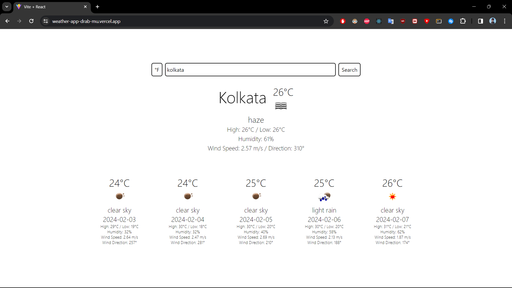
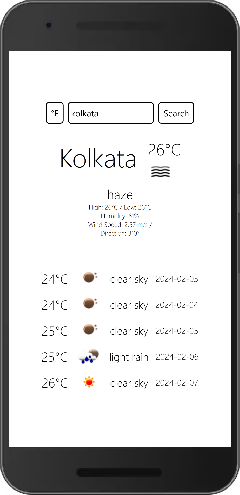

# WeatherApp

## Install Instructions

To get started with this project, follow these simple steps:

1. Clone the repository to your local machine using the following command in your terminal:

    ```bash
    git clone https://github.com/vinsin2002/WeatherApp.git
    ```

2. Change into the project directory:

    ```bash
    cd weather-app
    ```

3. Install the project dependencies using npm:

    ```bash
    npm install
    ```

4. Open the `.env` file in the root directory and add your own OpenWeatherMap API key.

5. Start the development server:

    ```bash
    npm run dev
    ```
# Screenshots





